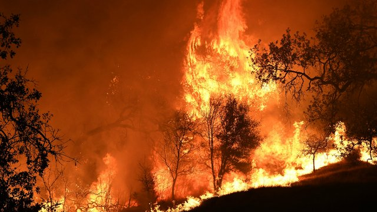

---    
title: दिवस्परि  
unicode_script: devanagari  
emphasis_as_inline_comments: true
---    
    
---    
{:.thumbnail}

## दवानलः  
{:.thumbnail}  
अक्र॑न्दद् अ॒ग्निः स्त॒नय॑न्निव॒ द्यौः  
क्षामा॒ *(=पृथिवीं)* रेरि॑हद् *(=आस्वादयन्)* वी॒रुधः॑ *(={वृक्ष}गुल्मान्)* सम॒ञ्जन्न् ।  
स॒द्यो ज॑ज्ञा॒नो *{दावानलः}* वि हीम् इ॒द्धो  
अख्य॒दा रोद॑सी भा॒नुना॑ भात्य॒न्तः ।  
  
उ॒शिक् *(=कामयिता)* पा॑व॒को अ॑र॒तिः *(=गन्ता)* सु॑मे॒धा  
मर्ते॑ष्व॒ग्निर॒मृतो॒ निधा॑यि ।  
इय॑र्ति *(=गमयति)* धू॒मम॑रु॒षम् *(=महत्)* भरि॑भ्र॒द्  
उच्छु॒क्रेण॑ शो॒चिषा॒ द्यामिन॑क्षत् *(=दीपयत्)*।  
  
